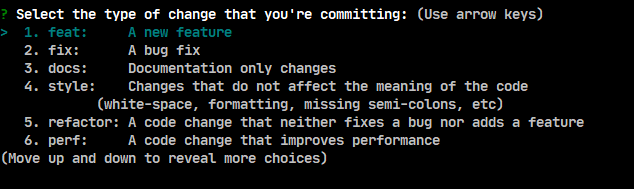

# cz-customizable

[![npm][npm-image]][npm-url]
 
[npm-image]: https://img.shields.io/npm/v/@fatesigner/cz-customizable.svg?color=blue&logo=npm
[npm-url]: https://npmjs.org/package/@fatesigner/cz-customizable

Fork by [leoforfree/cz-customizable](https://github.com/leoforfree/cz-customizable)
> Add sort number for choices.



## Install

```bash
# Make sure the corresponding version for commitizen is installed
npm i -D commitizen

npm i -D @fatesigner/cz-customizable
```

## Usage
Add this config to package.json

```bash
...
"config": {
  "commitizen": {
    "path": "node_modules/@fatesigner/cz-customizable"
  }
}
```

## Configuration
For detail, see [leonardoanalista/cz-customizable](https://github.com/leonardoanalista/cz-customizable)
